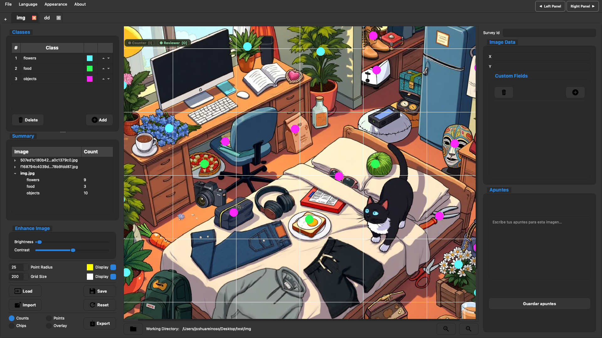

# Dot Target Counter

**Dot Target Counter** is a free, open source tool to assist with manually counting objects in images.



_Point data collected with Dot Target Counter will be very valuable training and validation data for any future efforts with computer assisted counting._

---

> **Desarrollado por Joshua Reinoso**, estudiante de Ingeniería en Ciencias de la Computación de la Universidad San Francisco de Quito (USFQ).
>
> Basado en [DotDotGoose](https://github.com/persts/DotDotGoose) — herramienta de conteo de código abierto desarrollada por el American Museum of Natural History.

**Versión:** 1.0

---

### Dependencies

Dot Target Counter is developed with the following libraries:

- PyQt6 (6.7.1)
- Pillow (10.3.0)
- Numpy (1.26.4)

## Installation

```bash
git clone https://github.com/joshuareinoso/Countmon
cd Countmon
python3 -m venv dtc-env
source dtc-env/bin/activate
python -m pip install --upgrade pip
python -m pip install -r requirements.txt
```

## Launching Dot Target Counter

```bash
python3 main.py
```

## Keyboard Shortcuts

### Modes

| Key | Action                                                                                                   |
| --- | -------------------------------------------------------------------------------------------------------- |
| `I` | Switch to **Counter** mode — instantly selects the last used class (or the first class if none was used) |
| `O` | Switch to **Reviewer** mode (click to select/move points)                                                |

### Navigation

| Key | Action             |
| --- | ------------------ |
| `↑` | Previous image     |
| `↓` | Next image         |
| `←` | Toggle left panel  |
| `→` | Toggle right panel |

### Canvas Panning

| Key         | Action             |
| ----------- | ------------------ |
| `W`         | Pan up             |
| `S`         | Pan down           |
| `A`         | Pan left           |
| `D`         | Pan right          |
| Mouse wheel | Zoom in / zoom out |

### Classes

| Key            | Action                 |
| -------------- | ---------------------- |
| `T`            | Create a new class     |
| `1` – `9`, `0` | Select class slot 1–10 |

### Points

| Key                    | Action                    |
| ---------------------- | ------------------------- |
| `H`                    | Toggle point display      |
| `G`                    | Toggle grid overlay       |
| `R`                    | Relabel selected point(s) |
| `Delete` / `Backspace` | Delete selected point(s)  |
| `Esc`                  | Deselect the active class |

### Mouse

| Action                    | Effect                             |
| ------------------------- | ---------------------------------- |
| Left-click (Counter mode) | Place a point                      |
| `Ctrl` + click            | Place a point from any mode        |
| `Shift` + drag            | Rubber-band select multiple points |
| Left-click + drag         | Pan the canvas                     |
| **Right-click + drag**    | **Pan the canvas (any mode)**      |

### File

| Key        | Action     |
| ---------- | ---------- |
| `Ctrl + S` | Quick save |
| `Ctrl + Z` | Undo       |
| `Ctrl + Y` | Redo       |

### Workspace & Tabs

| Key            | Action                                    |
| -------------- | ----------------------------------------- |
| `Ctrl + T`     | Open a new tab (folder picker)            |
| `Ctrl + W`     | Close the active tab                      |

> On macOS use `Cmd` instead of `Ctrl` for all shortcuts.
